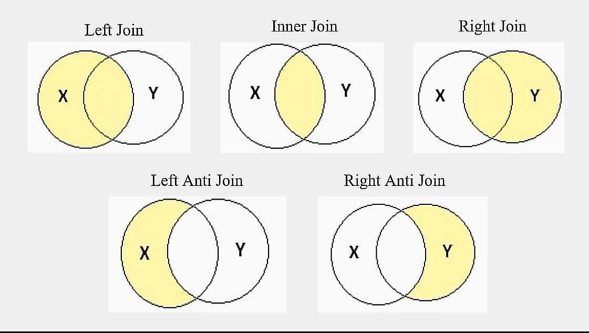

## Session 3 - Descriptive Statistics

---

The descriptive Statistics It is a great way to start exploring data and helps identify patterns of behavior.

## Topics to work on in this session

1. Mean
2. Standar desviation
3. Variance
4. Mode
5. Quiantiles

## Data Merging

